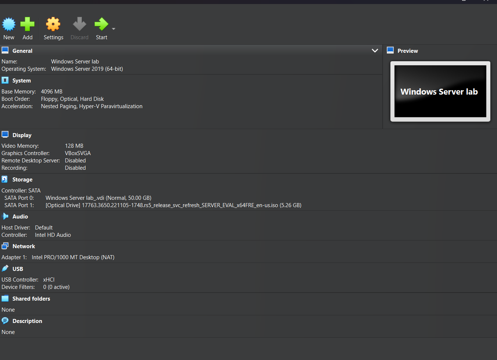
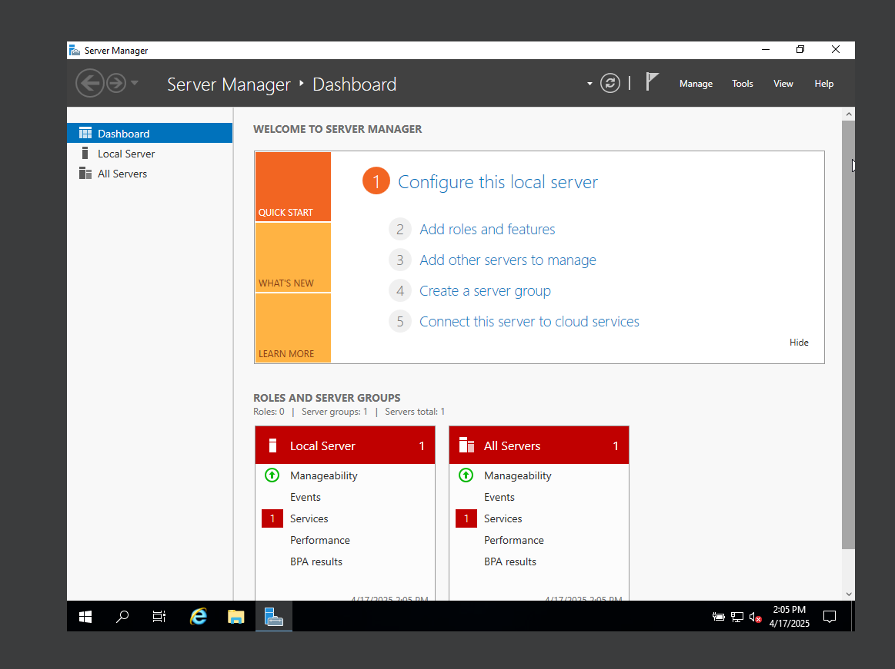
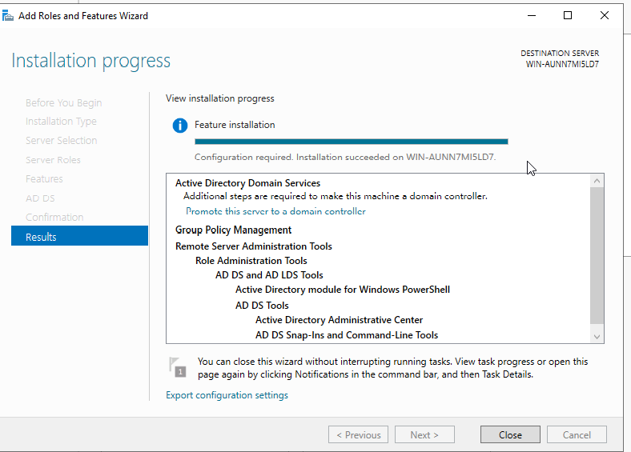

# 🛠️ Project 01 – Active Directory Deployment (Windows Server)

This project lays the foundational infrastructure for my Security Operations Center (SOC) lab by installing and configuring a Windows Server 2019 Domain Controller using Active Directory Domain Services (AD DS). It creates the central **authentication backbone** for future security and identity-based exercises.

---

## 📌 Overview

This project simulates a real-world enterprise server configuration to:

- Practice system administration
- Understand domain controller deployment
- Set up user authentication systems for lab environments

---

## ✅ Key Milestones Completed

- 🧱 Installed **Windows Server 2019** in VirtualBox  
- 🌐 Assigned a **static IP address**
- 🔒 Promoted the server to a **domain controller**
- 🌐 Created a domain: `lab.local`
- 🏷️ Created a test **Organizational Unit (OU)**
- 👤 Created a test user account for login simulation

---

## 📁 Folder Contents

| File/Folder                     | Description                                                 |
|-------------------------------|-------------------------------------------------------------|
| `Project1_AD_Deployment_With_GitHub_FINAL.pdf` | Full step-by-step instructions with screenshots         |
| `screenshots/`                 | Visual walkthroughs of setup progress                      |
| `README.md`                    | This project overview and documentation                    |

---

Screenshots of Key Steps

> _Click any image to enlarge in GitHub._

Windows Server Lab VM Settings  

---

Static IP Configuration  

---

Installing Windows Server Features  

---

Adding Active Directory Domain Services  

---

Promoting Server to Domain Controller  

---

Next Steps

This domain controller will serve as the backbone for:

- Group Policy experiments  
- Centralized identity and access control  
- SOC-level simulations involving detection, alerting, and auditing

---

Reflections

As someone early in my cybersecurity journey, this project taught me the fundamentals of:

- Domain services
- Identity configuration
- Real-world system administration

This setup is the first layer of my larger SOC Lab Build. 🚀  
Stay tuned for the detection, logging, response, and scripting phases!

---

Related Projects

- [Robert-SOC-Build Repo Home](../../README.md)  
- [Next: Project 02 – Group Policy & User Restrictions (Coming Soon)](../Project_02_GroupPolicy/README.md)

